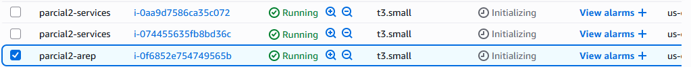
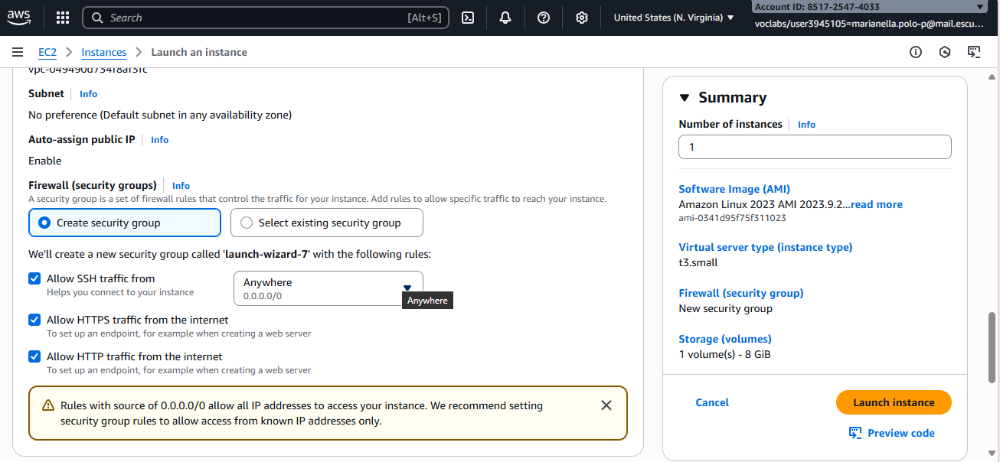

## Parcial 2 - AREP 
By. Marianella Polo - 2025

## Enunciado
Diseñe un prototipo de sistema de microservicios que tenga un servicio (En la figura se representa con el nombre Math Services) para computar las funciones numéricas.  El servicio de las funciones numéricas debe estar desplegado en al menos dos instancias virtuales de EC2. Adicionalmente, debe implementar un service proxy que reciba las solicitudes de llamado desde los clientes  y se las delegue a las dos instancias del servicio numérico usando un algoritmo de round-robin. El proxy deberá estar desplegado en otra máquina EC2. Asegúrese de poder configurar las direcciones y puertos de las instancias del servicio en el proxy usando variables de entorno del sistema operativo.  Finalmente, construya un cliente Web mínimo con un formulario que reciba el valor y de manera asíncrona invoke el servicio en el PROXY. Puede hacer un formulario para cada una de las funciones. El cliente debe ser escrito en HTML y JS.

## Tecnologías Utilizadas

Maven, Git, GitHub, Spring, HTML5 y js.

## Usando VM de EC2 de AWS
Una vez que tengamos nuestras instancias de EC2 en AWS, debemos conectarnos a ellas a través de SSH. Para ello, debemos tener la clave .pem que se nos proporcionó al crear la instancia.



En caso de que no tengamos instalados los prerequisitos, debemos instalarlos en cada una de las instancias. Para ello, ejecutamos los siguientes comandos:

Para instalar git:

`sudo yum install -y git`

Para instalar java 17:

`sudo yum install -y java-17-amazon-corretto-devel`

Para instalar maven:


`sudo dnf install maven`


Usando nuestro editor de código, abrimos el proyecto y modificamos el archivo com.arep.loadBalancer.Invoker.java, y cambiamos las direcciones IP de las máquinas virtuales de AWS por las direcciones IP o el DNS público IPv4 de nuestras instancias de EC2. - En proceso



En este caso, una VM será para el servicio proxy y las otras dos (o más) serán para el servicio llamado "MathService". En cada una de las instancias, debemos instalar git, maven y java 17. Una vez hecho esto, clonamos el repositorio en cada una de las instancias con el siguiente comando:

`git clone https://github.com/AREP-Polo/Parcial2.git`

Y nos dirigimos al directorio creado con

`cd Parcial2`

## Creación del proyecto con mvn y spring

Este proyecto se creo haciendo uso de Spring Initializr, para construir la base del proyecto

Desde el link: `https://spring.io/guides/gs/rest-service`

## Ejecutando la aplicación

Para ejecutar la aplicación, primero debemos compilar el proyecto con el siguiente comando `mvn clean install`
. Esto nos permitirá limpiar las construcciones previas de otras versiones y luego compilará el proyecto.

#### Local

Abrimos una terminal y ejecutamos el siguiente comando:
```
  java -cp "target/classes/;target/dependency/*" com.arep.search.MathService
```

Abrimos otra terminal y ejecutamos el siguiente comando:
```
  java -cp "target/classes/;target/dependency/*" com.arep.loadBalancer.ProxyService
```

Para visualizar la aplicación, escogemos algún navegador e ingresamos la URL http://localhost:8080/ en la barra de direcciones. Allí encontraremos
el formulario donde se podrá ingresar la lista de números, el número a buscar y seleccionar el algoritmo de búsqueda deseado.
El siguiente es un ejemplo de cómo se vería la aplicación en el navegador.


Y en la consola del servicio proxy, podemos ver la comprobación de que se están realizando las peticiones a los servicios de ordenamiento.


